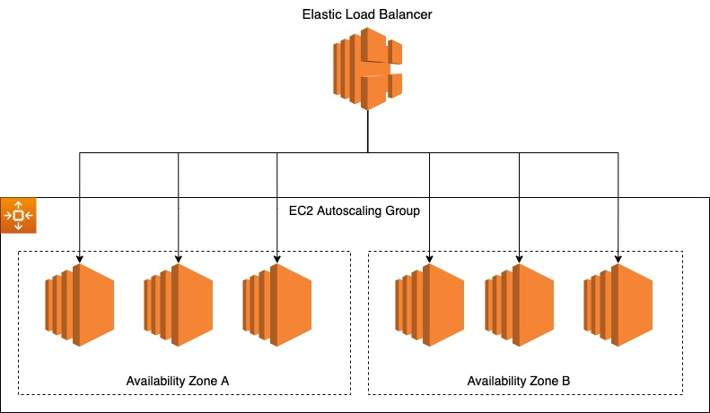

# Matrix Project
Repository for matrix coding Assignment

# Description
This repository contains everything that is needed to setup a Matrix server using this repository: https://github.com/spantaleev/matrix-docker-ansible-deploy

# Approach

Based on the Notion page, I felt like the best approach was to get this working on a small scale (single EC2 instance) so that I had a strong understanding of the requirements, the intricacies of the process, and the details of each of the components.   The files in this repository should allow anyone to spin up the required resources in AWS to host a matrix server. 

I initially went through the process manually (primarily through the AWS console) to make sure everything was setup properly.  After successfully instantiating a Matrix server, creating a user, and spinning up a test channel, I moved forward with automating much of the deployment process (can follow the instructions below on deployment).

After gaining a better understanding of what was required for a single server, this allowed me to extrapolate and come up with a proposed architecture for a low latency, scalable infrastructure setup for one or multiple matrix servers (See the [Proposed Architecture](#proposed-architecture) section below).

# Proposed Architecture

Below is a diagram of the architecture I'm proposing for a low latency, scalable setup for one or multiple Matrix servers.

The infrastructure would be composed of an [EC2 Autoscaling Group](https://console.aws.amazon.com/ec2autoscaling/) based on a standard [EC2 template](https://us-west-2.console.aws.amazon.com/ec2/v2/home?region=us-west-2#CreateTemplate:autoScalingGuidance=true) similar to the one used in this repository.  We would additionally want to automate the process of using ansible to install matrix on each of the EC2 images in the Autoscaling group.

This would enable scaling up and down servers based on thresholds for key metrics (e.g. CPU usage).  It would also ensure maximum liveness anytime usage spikes.

We would then [attach an Elastic Load Balancer to our EC2 Autoscaling Group](https://docs.aws.amazon.com/autoscaling/ec2/userguide/attach-load-balancer-asg.html) to the EC2 Autoscaling group.  This will automate the process of routing traffic to the servers to the most optimal instances/availability zones that will in turn result in low latency for users/devices.

# Matrix Server Deployment Instructions

## AWS Infrastructure Setup

1. Clone the repository above to your computer
2. Setup an AWS Account if you don't have one already
3. Setup AWS CLI locally
4. Add a new CLI api key for your AWS User
5. Configure the AWS cli by running "aws configure" and entering your API Key and Secret
6. Navigate to Route 53 in the AWS Console
7. Make sure you have added a payment method and you will need a valid e-mail for this
8. Purchase any domain name under "Registered domains"
9. This will setup a Hosted Zone once your domain name has been approved
10. Create a EC2 Key Pair named "matrix" and save the .pem file to the base folder in the repository you cloned in step 1 (matrix-docker-ansible-deploy)
11. Navigate to the cloudformation folder (cd cloudformation)
12. Run the following to deploy the matrix server: `aws cloudformation deploy --stack-name MatrixServer --template-file matrix_server.yaml --parameter-overrides KeyName=matrix`
13. Once you have confirmed that the hosted zone for the domain you registered has been created (Route 53 -> Hosted Zones), find your hosted zone ID (Under Hosted Zone details).  You will need this for the next step
14. run the following to deploy the matrix DNS Server and replace the following:`aws cloudformation deploy --stack-name MatrixDNS --template-file matrix_dns.yaml --parameter-overrides HostedZoneId=<insert_hz_id_here> DomainName=<insert_domain_name_here>`
	- insert_hz_id_here with your hosted zone id
  	- insert_domain_name_here with your registered domain name

## Matrix Installation (Ansible Deployment)
1. In the vars.yml file, fill out the following:
  	- enter in any password value for both matrix_homeserver_generic_secret_key and matrix_postgres_connection_password
  	- enter the domain you purchased under matrix_domain
  	- enter the e-mail you'd like to use for matrix_ssl_lets_encrypt_support_email
2. In the hosts file, fill out the following:
  	- replace ec2-public-ipv4-address with the ec2 public ipv4 address (can find this in the aws console) for your instance
  	- replace domain_name with the domain name you purchased
3. Make sure you have passlip installed on your local computer (pip3 install passlib) (I got an error for this when trying to install matrix on the server)
4. Make sure you have ansible installed on your computer (`pip3 install ansible`)
5. Navigate to the main directory for the repo you cloned
6. Run `ansible-playbook -i inventory/hosts setup.yml --tags=setup-all`
7. Run `ansible-playbook -i inventory/hosts setup.yml --tags=start`

# Considerations

I set matrix_synapse_enable_registration equal to true to make it easier to setup user accounts.  If I were developing a productionalized system for this I would make sure that capcha was enabled (to eliminate bots) or take this out completely

